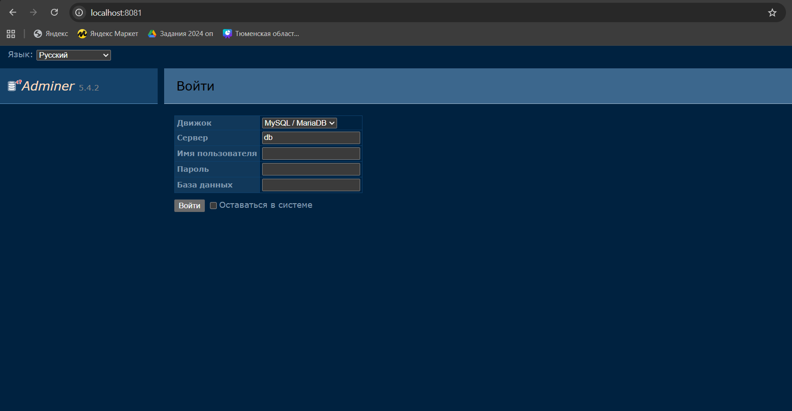
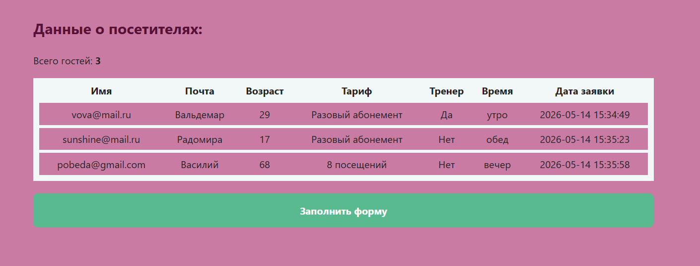

# Laboratory work №4: API
Learn how to work with a MySQL database via PHP.


## 💃 Author
Merkulova Elizaveta, AM-2

## 🍽️ Project content

```Dockerfile``` — image for new PHP container

```www/process.php``` — PHP data processing

```www/index.php``` — PHP page

```www/form.html``` — registration form

```docker-compose.yml``` — Nginx description

```nginx.conf``` — Nginx configuration

```screenshots/``` — all screenshots

## 📸 Screenshots



## 🎉 Result
The data from the form is stored in the database.
The data is sorted by creation date.
There is an age filter and counting the number of alerts.
